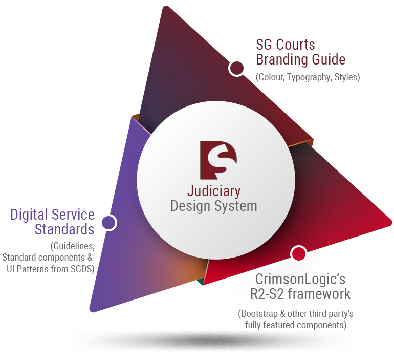

# About Judiciary Design System

JDS is a frontend framework that aims to provide a beautiful common visual language and user experience for visitors of Singapore Courts' web applications. It provides designers and developers with customisable components to help them easily implement the Singapore Government's Digital Service Standards.

* Judiciary design system **beta package files** are available at [**GitHub**](https://github.com/JudiciaryDS-Github/jds)
* Judiciary design system **documentation** is available at[ **GitBook**](https://sg-jds.gitbook.io/jds-beta/v/main/)\*\*\*\*

As a common reference for all parties, JDS acts the single source of truth to enables all interested parties to efficiently deliver consistent branding and great user experience effectively across all modes of digital interactions to the judiciary users.

### This collection is designed with reusability and quick deployment in mind and includes:

* Visual Styling Specifications \(e.g. colours and typography\)
* Design Elements \(e.g. iconography\)
* Layouts and containers \(e.g. grid system\)
* UI Components \(e.g. accordions and buttons\)
* Notes that guide their usage
* When appropriate, the design philosophy, considerations and versioning information

## Outcome / Benefits

## \(Powered by CrimsonLogic\)

