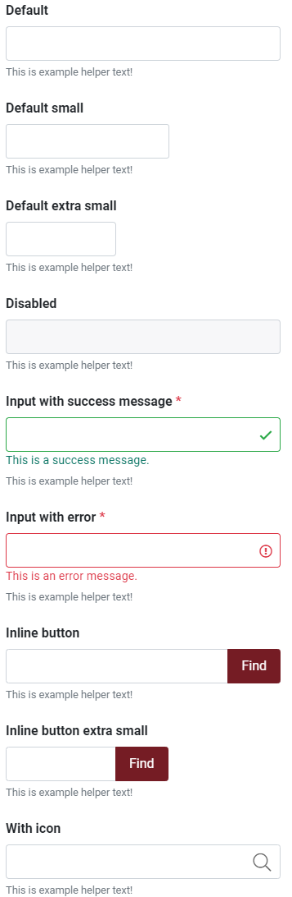

# Badges

Small numerical value or status descriptor for UI elements. Badge normally appears in proximity to notifications or user avatars with eye-catching appeal, typically displaying unread messages count.

#### [Interactive demo](http://cloud.crimsonlogic.com/2021/website/jds/v1/components.html#badge-wrapper)

### Examples

Badges scale to match the size of the immediate parent element by using relative font sizing and em units.

### For notification count or new notification

Unread messages count or new message notification appears close to button or icon.

