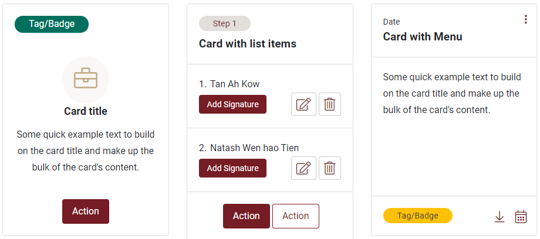

# Overview

## Masthead

All .gov.sg digital services shall implement the Official Government Banner \(containing the Singapore Government Online Logo\) across all pages.



```text
<div class="jds-sggov-masthead">
    <div class="container-fluid"> <a href="https://www.gov.sg" target="_blank"> <span class="sgds-icon sgds-icon-sg-crest"></span> <span class="is-text">A Singapore Government Agency Website</span> </a> </div>
</div>
```

### Guidelines

Your Masthead should:

* Contain the Singapore Government Logo. It shall be positioned at the top left corner of the banner.
* Include the official government site descriptor. It shall state ‘A Singapore Government Agency Website’.
* Be positioned at the top left corner of the web page

## Global Header with Navigation panel

All judiciary websites shall adopt a Global Primary Navigation Panel across all pages. The following header navigation has 2 types of dropdowns that can be used based on the context and need.


```text
<header class="navbar-container">
    <nav class="navbar navbar-expand-lg ">
      <div class="container-fluid"> 
        <!-- Menu Logo --> 
        <a class="navbar-brand" href="#"></a>
        <div class="navbar-toggler" onclick="menuMove(this)">
          <div class="menu-icon">
            <div class="menu-bar1"></div>
            <div class="menu-bar2"></div>
            <div class="menu-bar3"></div>
          </div>
        </div>
        <div class="navbar-collapse">
          <ul class="navbar-nav">
            <li class="nav-item mx-md-2"><a class="nav-link"  href="#" title="Go to Item 2">About</a></li>
            <li class="nav-item dropdown position-static"> <a class="nav-link dropdown-toggle" href="#" id="navbarDropdown" role="button" data-toggle="dropdown" aria-haspopup="true" aria-expanded="false">Layouts <span class="caret"></span></a> 
              
              <!--Add .menu-inline class if inline menu is required-->
              <div class="dropdown-menu menu-inline" aria-labelledby="navbarDropdown">
                <div class="container-fluid"> <a class="dropdown-item" href="page-empty.html" title="Go to Item 1A">Header + Body (Empty) + Footer</a> <a class="dropdown-item" href="page-with-content.html" title="Go to Item 1B">Header + Body with Content + Footer</a> <a class="dropdown-item" href="page-with-form.html" title="Go to Item 1C">Header + Body with Form + Footer</a> </div>
              </div>
            </li>
            <li class="nav-item dropdown"> <a class="nav-link dropdown-toggle" href="#" id="navbarDropdown1" role="button" data-toggle="dropdown" aria-haspopup="true" aria-expanded="false">Pages <span class="caret"></span></a>
              <div class="dropdown-menu" aria-labelledby="navbarDropdown"> <a class="dropdown-item" href="#" title="Go to Item 1A">Page 1</a> <a class="dropdown-item" href="#" title="Go to Item 1B">Page 2</a> <a class="dropdown-item" href="faq.html" title="Go to Item 1C">FAQ</a> </div>
            </li>
            <li class="nav-item dropdown position-static"> <a class="nav-link dropdown-toggle" href="#" id="navbarDropdown2" role="button" data-toggle="dropdown" aria-haspopup="true" aria-expanded="false">Components <span class="caret"></span></a>
              <div class="dropdown-menu" aria-labelledby="navbarDropdown">
                <div class="container-fluid megamenu">
                  <div class="row">
                    <div class="col-lg-4"> <a class="dropdown-item" href="#accordion-wrapper">Accordion</a> <a class="dropdown-item" href="#badge-wrapper">Badge</a> <a class="dropdown-item" href="#breadcrumb-wrapper">Breadcrmb</a> <a class="dropdown-item" href="#buttons-wrapper">Button</a> <a class="dropdown-item" href="#cards-wrapper">Card</a> <a class="dropdown-item" href="#callouts-wrapper">Callout</a> <a class="dropdown-item" href="#carousel-wrapper">Carousel</a> <a class="dropdown-item" href="#checkbox-wrapper">Checkbox</a> <a class="dropdown-item" href="#dropdown-wrapper">Dropdown</a> </div>
                    <div class="col-lg-4"> <a class="dropdown-item" href="#hero-wrapper">Hero</a> <a class="dropdown-item" href="#loader-wrapper">Loader</a> <a class="dropdown-item" data-toggle="dropdown" href="#modals-wrapper">Modal</a> <a class="dropdown-item" href="#notfication-wrapper">Notification</a> <a class="dropdown-item" href="#pagination-wrapper">Pagination</a> <a class="dropdown-item" href="#popover-wrapper">Popover</a> <a class="dropdown-item" href="#radiobutton-wrapper">Radio Button</a> <a class="dropdown-item" href="#scrolltotop-wrapper">Scroll to top</a> <a class="dropdown-item" href="#tab-wrapper">Tab</a> </div>
                    <div class="col-lg-4"> <a class="dropdown-item" href="#static-table-wrapper">Table</a> <a class="dropdown-item" href="#tag-wrapper">Tag</a> <a class="dropdown-item" href="#textarea-wrapper">Text Area</a> <a class="dropdown-item" href="#textinput-wrapper">Text Input</a> <a class="dropdown-item" href="#tooltip-wrapper">Tooltip</a> <a class="dropdown-item" href="#typography-wrapper">Typography</a> <a class="dropdown-item" href="#wizard-wrapper">Wizard</a> </div>
                  </div>
                </div>
              </div>
            </li>
          </ul>
          <ul class="navbar-nav ml-md-auto">
            <li class="nav-item ml-2 ml-md-0 my-2 my-md-0">
              <button class="btn btn-primary btn-lg" type="button" aria-label="Login" title="Login Now" onclick="javascript:location.href=''"><span class="fal fa-unlock-alt"></span> Login</button>
            </li>
          </ul>
        </div>
      </div>
  </nav>
</header>
```

## Side Nav \(JS required\)

All judiciary websites shall adopt a Global Primary Navigation Panel across all pages.

For services with 2 or more levels of navigation, pages should contain secondary navigation, at the side to aid users in locating site content. \(Optional\)


```text
<aside class="jds-menu">
    <div class="row">
        <div class="col-md-4 col-lg-3">
            <div class="side-nav">
                <ul>
                <li><a href="#"><span>Main menu(no icon)</span></a></li>
                <li class="dropdown-cust"><a href="javascript:void(0)" class="dropdown-toggle-cust"><span>Main menu + sub nav (no icon)</span></a>
                <div class="dropdown-menu-cust"> <a class="dropdown-item active" href="#">Sub menu one</a> <a class="dropdown-item" href="#">Sub menu two</a> <a class="dropdown-item" href="#">Sub menu three</a> </div>
                </li>
                <li><a href="#"><i class="fal fa-briefcase"></i><span>Main menu(has icon)</span></a></li>
                <li class="dropdown-cust"><a href="javascript:void(0)" class="dropdown-toggle-cust"><i class="fal fa-briefcase"></i><span>Main menu + sub nav (has icon)</span></a>
                <div class="dropdown-menu-cust"> <a class="dropdown-item active" href="#">Sub menu one</a> <a class="dropdown-item" href="#">Sub menu two</a> <a class="dropdown-item" href="#">Sub menu three</a> </div>
                </li>
                </ul>
            </div>
        </div>
    </div>
</aside>
```

### Guidelines

Side navigation should:

* Be positioned on the left of every inner page in a digital service
* Be hidden when used on mobile devices

## Footer

We advise that you avoid using more than 6 columns of footer links.


```text
<footer class="jds-footer">
    <div class="sitemap">
        <div class="container-fluid">
            <h2 class="jds-footer-sitemap-header text-left">Singapore Courts</h2>
            <div class="footer-links"> <a href="#">About</a> <a href="notices.html">Notices</a> <a href="faq.html">FAQs</a> <a href="#">Contact us</a> </div>
            </div>
        </div>
        <hr class="divider">
        <div class="copyright">
            <div class="container-fluid">
            <div class="row">
            <div class="col-lg-6 ">
            <div class="footer-links"> <a href="#">Report Vulnerability <i class="fal fa-external-link ml-1"></i></a> <a href="#">Privacy Policy</a> <a href="#">Terms of Use</a> </div>
            <div class="powered-by">Powered by  </div>
            </div>
            <div class="col-lg-6 mobile-mt-3 text-right">
            <div>© 2021 Government of Singapore</div>
            <div> Last updated: 15 Jan 2021</div>
            </div>
        </div>
        </div>
    </div>
</footer>
```

Note: Users have to ensure all the above sections must be inside a wrapper div that is   


