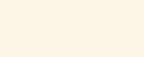

# Colours

## Primary Colours

The maroon colours serve as the primary colours serve as the primary action colour, bringing the boldness to the brand, it is used in logical ways through the website to highlight the important bits such as call to action. We use Primary for actions, buttons and text links wherever necessary.

<table>
  <thead>
    <tr>
      <th style="text-align:left">Colour</th>
      <th style="text-align:left"></th>
    </tr>
  </thead>
  <tbody>
    <tr>
      <td style="text-align:left">
        

          
        

        
Primary
            <b>#751c24</b>
        

      </td>
      <td style="text-align:left">
        

          
        

        
Primary L1
            <b>#a02842</b>
        

      </td>
    </tr>
  </tbody>
</table>

## Secondary Colours

Our secondary colour is navy blue, making the visual look professional and authoritative, at the same time balancing the intensity of the primary colour. We use the secondary colour for components and headers. As dark colour may grab attention, use it sparingly and purposefully.

<table>
  <thead>
    <tr>
      <th style="text-align:left">Colour</th>
    </tr>
  </thead>
  <tbody>
    <tr>
      <td style="text-align:left">
        

          
        

        
Secondary
            <b>#283c61</b>
        

      </td>
    </tr>
  </tbody>
</table>

## Tertiary Colours

Our tertiary colour is royal gold, the colour creates a sense of prestige and elegance to the design. Use this colour on small design elements only, such as icons, as using it too much may cause the design to look unapproachable and exclusive.

<table>
  <thead>
    <tr>
      <th style="text-align:left">
        

          
        

        
Tertiary
           <b>#c4ad89</b>
        

      </th>
    </tr>
  </thead>
  <tbody></tbody>
</table>

## Supplementary Colours

Supplementary colours are used as backgroud colours to divide different sections within a page. The light beige colour creates a sense of calmness and softness when use as background colour.  
  
**Supplentary colour 1**

<table>
  <thead>
    <tr>
      <th style="text-align:left">Colour</th>
      <th style="text-align:left"></th>
    </tr>
  </thead>
  <tbody>
    <tr>
      <td style="text-align:left">
        

          
        

        
Supp. 1 Light
            <b>#faf7f7</b>
        

      </td>
      <td style="text-align:left">
        

          
        

        
Supp. 1
            <b>#d1cfcf</b>
        

      </td>
    </tr>
  </tbody>
</table>

**Supplentary colour 2**

<table>
  <thead>
    <tr>
      <th style="text-align:left">Colour</th>
    </tr>
  </thead>
  <tbody>
    <tr>
      <td style="text-align:left">
        

          
        

        
Supp. 2
            <b>#0e1524</b>
        

      </td>
    </tr>
  </tbody>
</table>

## System Colours

When we need to communicate an information to digest or the status of an update, we use this palette of colors.

<table>
  <thead>
    <tr>
      <th style="text-align:left">Colour</th>
      <th style="text-align:left">Colour</th>
      <th style="text-align:left">Colour</th>
    </tr>
  </thead>
  <tbody>
    <tr>
      <td style="text-align:left">
        

          
        

        
Info
            <b>#283c61</b>
        

      </td>
      <td style="text-align:left">
        

          
        

        
Info Light

        
<b>  #eeeff2</b>
        

      </td>
      <td style="text-align:left"></td>
    </tr>
    <tr>
      <td style="text-align:left">
        

          
        

        
Success
           <b> #01b99d</b>
        

      </td>
      <td style="text-align:left">
        
&lt;b&gt;&lt;/b&gt;
          
        

        
Success Light

        
<b>  #e6f8f5</b>
        

      </td>
      <td style="text-align:left">
        
&#x200B;
          &#x200B;

        
Success Dark

        
<b> #016f5e</b>
        

      </td>
    </tr>
    <tr>
      <td style="text-align:left">
        
&lt;b&gt;&lt;/b&gt;
          
        

        
Warning
           <b> #ffd975</b>
        

      </td>
      <td style="text-align:left">
        
&lt;b&gt;&lt;/b&gt;
          
        

        
Warning Light

        
<b>  #fdf6e6</b>
        

      </td>
      <td style="text-align:left">&lt;b&gt;&lt;/b&gt;</td>
    </tr>
    <tr>
      <td style="text-align:left">
        

          
        

        
Error
           <b> #b00020</b>
        

      </td>
      <td style="text-align:left">
        
&lt;b&gt;&lt;/b&gt;
          
        

        
Error Light

        
<b>  #f8d7da</b>
        

      </td>
      <td style="text-align:left">
        
&#x200B;
          &#x200B;

        
Error Dark

        
<b> #7b0016</b>
        

      </td>
    </tr>
    <tr>
      <td style="text-align:left">
        
&lt;b&gt;&lt;/b&gt;
          
        

        
Example
           <b> #a57cb8</b>
        

      </td>
      <td style="text-align:left">
        
&lt;b&gt;&lt;/b&gt;
          
        

        
Example Light

        
<b>  #f8d7da</b>
        

      </td>
      <td style="text-align:left">
        
&#x200B;
          &#x200B;

        
Example Dark

        
<b> #7b0016</b>
        

      </td>
    </tr>
  </tbody>
</table>

