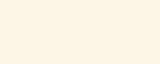

# Colours

## Primary Colours

The maroon colors serve as the primary action color, such as button, across the website.

<table>
  <thead>
    <tr>
      <th style="text-align:left">Colour</th>
      <th style="text-align:left">Colour</th>
    </tr>
  </thead>
  <tbody>
    <tr>
      <td style="text-align:left">
        

          
        

        
Primary
            <b>#751c24</b>
        

      </td>
      <td style="text-align:left">
        

          
        

        
Primary L1
            <b>#a02842</b>
        

      </td>
    </tr>
  </tbody>
</table>

## Secondary Colours

Use secondary color for main header and components; use it sparing and purposefully.

<table>
  <thead>
    <tr>
      <th style="text-align:left">Colour</th>
      <th style="text-align:left">Colour</th>
    </tr>
  </thead>
  <tbody>
    <tr>
      <td style="text-align:left">
        

          
        

        
Secondary
            <b>#283c61</b>
        

      </td>
      <td style="text-align:left">
        

          
        

        
Khaki

        
 <b>#e2dfdb</b>
        

      </td>
    </tr>
    <tr>
      <td style="text-align:left">
        

          
        

        
Khaki D1
            <b>#a59b8a</b>
        

      </td>
      <td style="text-align:left"></td>
    </tr>
  </tbody>
</table>

## Supplementary Colours

Use as background colors to divide different sections within a page.

<table>
  <thead>
    <tr>
      <th style="text-align:left">Colour</th>
      <th style="text-align:left">Colour</th>
    </tr>
  </thead>
  <tbody>
    <tr>
      <td style="text-align:left">
        

          
        

        
Supplementary-BG Dark
            <b>#343e47</b>
        

      </td>
      <td style="text-align:left">
        

          
        

        
Supplementary-BG Light
            <b>#eeece9</b>
        

      </td>
    </tr>
  </tbody>
</table>

## System Colours

When we need to communicate an information to digest or the status of an update, we use this palette of colors.

<table>
  <thead>
    <tr>
      <th style="text-align:left">Colour</th>
      <th style="text-align:left">Colour</th>
      <th style="text-align:left">Colour</th>
    </tr>
  </thead>
  <tbody>
    <tr>
      <td style="text-align:left">
        

          
        

        
Info-Dark
            <b>#283c61</b>
        

      </td>
      <td style="text-align:left">
        

          
        

        
Info-Light

        
<b>  #eeeff2</b>
        

      </td>
      <td style="text-align:left"></td>
    </tr>
    <tr>
      <td style="text-align:left">
        

          
        

        
Success
            <b>#</b>01b99d

      </td>
      <td style="text-align:left">
        

          
        

        
Success L1

        
<b>  #</b>e6f8f5

      </td>
      <td style="text-align:left">
        
&#x200B;
          &#x200B;

        
Success D1

        
 <b>#</b>016f5e

      </td>
    </tr>
    <tr>
      <td style="text-align:left">
        

          
        

        
Warning
            <b>#</b>ffd975

      </td>
      <td style="text-align:left">
        

          
        

        
Warning L1

        
<b>  #</b>fdf6e6

      </td>
      <td style="text-align:left"></td>
    </tr>
    <tr>
      <td style="text-align:left">
        

          
        

        
Error
            <b>#</b>b00020

      </td>
      <td style="text-align:left">
        

          
        

        
Error L1

        
<b>  #</b>f8d7da

      </td>
      <td style="text-align:left">
        
&#x200B;
          &#x200B;

        
Error D1

        
 <b>#</b>7b0016

      </td>
    </tr>
    <tr>
      <td style="text-align:left">
        

          
        

        
Example
            <b>#</b>a57cb8

      </td>
      <td style="text-align:left">
        

          
        

        
Example L1

        
<b>  #</b>f8d7da

      </td>
      <td style="text-align:left">
        
&#x200B;
          &#x200B;

        
Example D1

        
 <b>#</b>7b0016

      </td>
    </tr>
  </tbody>
</table>

